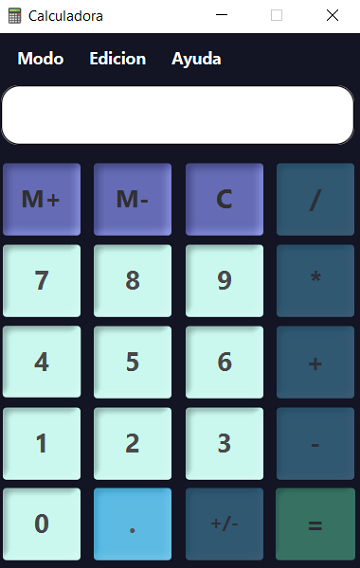
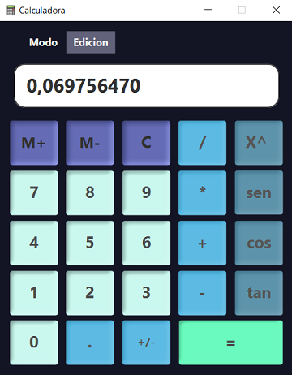
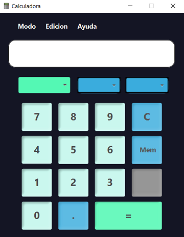
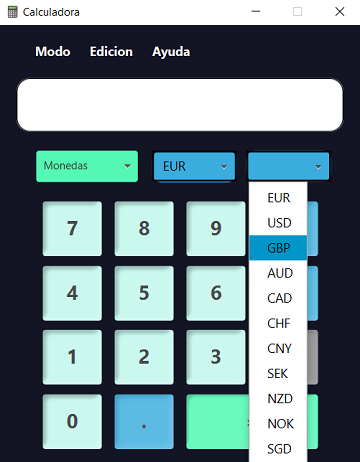
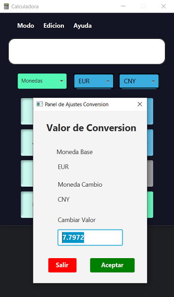

# ProyectoFinal_DI_2024.github.io
# Calculadora científica y de conversiones

> En el **Proyecto** dentro de **Parte1** contiene el fichero **jar**, para poder ejecutarse. 
> El proyecto esta construido por 3 tipos de calculadoras:
> - Sencilla
> - Cientifica
> - Conversion

## Calculadora Sencilla

La calculadora tiene un **menú superior** que tiene tres entradas de *Modo*, *Edicion* y *Ayuda*.

- **Modo:** Navegacion hacia la calculadora **científica**.
- **Edicion:** Navegacion hacia la calculadora **conversión**. 
- **Ayuda:** Contiene un **historial** de las operaciones que has realizado mediante un *ListView*.

  

## Calculadora Cientifica

En el **menú superior** en esta calculadora tiene dos entradas *Modo* y *Edicion*.
Podrás navegar hacia la **Calculadora cientifica** y la de **conversiones**.

- Contiene las operaciones trigonométricas y exponenciales.
- Introduce el **valor** y al seleccionar *seno*, *coseno* y *tangente* se calculará **automaticamente**.
- Para realizar exponenciales, seleccionaló y generará el resultado con el *igual*.

  

## Calculadora de Conversion

El **sistema de conversiones** tiene un *Combobox* principal para seleccionar el método de conversión: *Monedas*, *Longitud*, *Tiempo* y *Masa*. 

- Elige desde los **combobox Azules** el valor de *origen* y valor *destino*.

  

- El valor de conversion de las monedas se gestiona *automaticamente* a traves de una **API**.

  

- Para las conversiones monetarias, podrás cambiar el *valor de conversión* en el menu superior **Valor Conversion** que se abrirá desde el **menú Edición**.

- Vista Panel Conversion.

  

